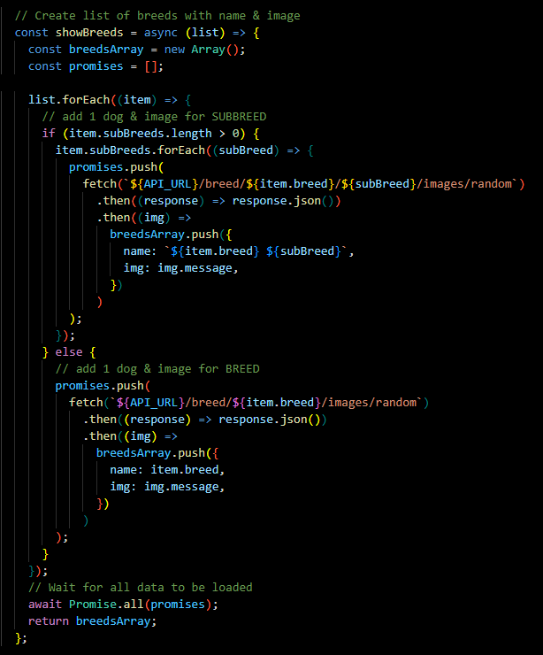

# Dogs Breeds

A project using an API to retrieve dog breeds and then present them.

[See Dog Breeds](https://artur-it.github.io/API-Dogs/)

**Main features**:

- RWD
- Random Dog for today
- free API

## 💡 Technologies

## 🤔 Solutions provided in the project

- function to create array with name dog & img

## 💭 Improvements?

1. Search breed
